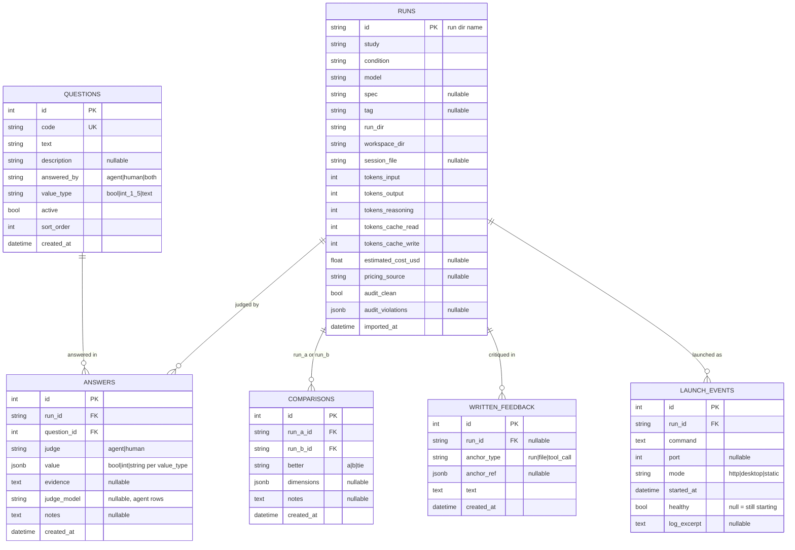

# Data Model (as built)

Source of truth: `models.py`. Schema created via `Base.metadata.create_all`
(no Alembic migrations in this MVP).

## Mermaid erDiagram (as actually built)

## Constraints

- `answers`: UNIQUE `(run_id, question_id, judge)` — one answer per
  judge per question per run. POSTs upsert within a judge.
- `questions.code`: UNIQUE.
- `comparisons`: application-level check that `run_a_id != run_b_id`
  (Pydantic validator; not a DB constraint).
- **answered_by enforcement** (application-level, in `api.py`): an answer
  with `judge="agent"` is rejected with HTTP 403 when the question's
  `answered_by == "human"`. Human rows may answer any active question.
- **value validation** (application-level, `_validated_value`):
  `bool` → must be JSON bool; `int_1_5` → int in [1..5] (bools rejected);
  `text` → coerced to string. Violations → HTTP 422.
- Inactive questions reject new answers (HTTP 409).

## Generalist notes

- Rubric questions are rows, not schema. New studies/tasks add question
  rows (UI: /questions) without migrations.
- `runs.condition`, `runs.tag` are free-text labels; nothing in the schema
  is study-010-specific except the seed data (imported idempotently) and
  the `runs.study` default.

## launch_events (SPEC 9 addendum)

One row per live-app launch attempt (written at launch; `healthy` resolved
when the launcher's health probe settles — null while starting).

| column | type | notes |
|---|---|---|
| id | int PK | |
| run_id | FK runs | |
| command | text | resolved or overridden launch command |
| port | int nullable | allocated port (8450+); may differ from the app's hardcoded port |
| mode | text | `http` (URL probe) \| `desktop` (process-alive, GUI on host) \| `static` (http.server) |
| started_at | timestamptz | |
| healthy | bool nullable | null = pending resolution |
| log_excerpt | text nullable | last ~40 lines of the app's output |

Health resolution requires the launched process to still be alive when a
URL probe succeeds (guards against unrelated servers squatting on
README-declared ports).
