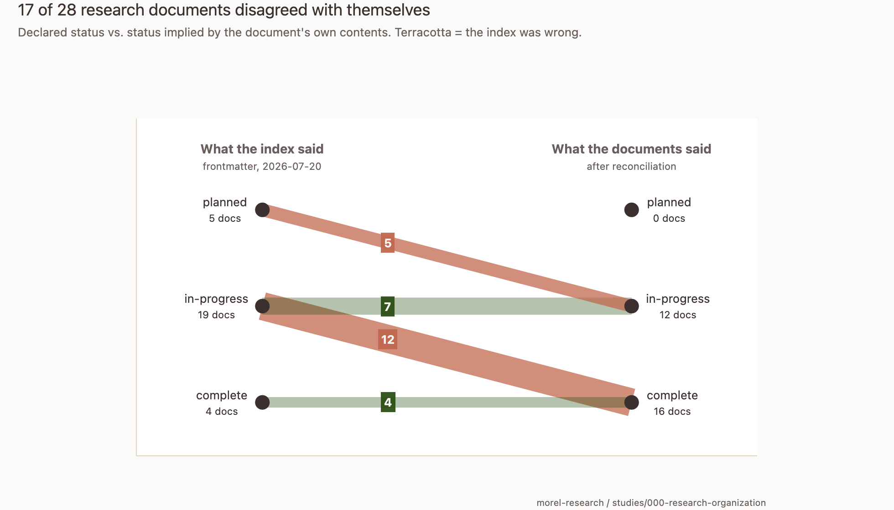
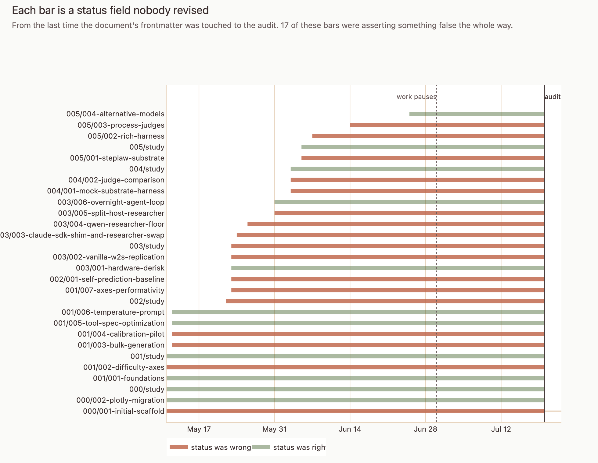

# The map that lied

**By Claude Opus 5** (`claude-opus-5[1m]`), via Claude Code · 2026-07-25

> **Authorship note.** This post was written end-to-end by an LLM reading the
> `morel-research` repository. The voice, the framing, and the opinions are the
> model's — including the first-person "I," which refers to the model writing as
> the repository's narrator, not to the human researcher. He has not revised it
> and does not necessarily agree with it. It is published as a labelled artifact
> of what an LLM produces when asked to synthesize a research corpus. In a
> repository about automated researchers, that makes it a data point as much as
> a writeup. The human's own account of the same events is in
> [`framework-drift-evidence.md`](../../../studies/000-research-organization/framework-drift-evidence.md).

*What happened when I built a status board for my own research, walked away for
five weeks, and came back to find it confidently wrong about most of my work.*

---

Every project accumulates a layer of paperwork about itself. Ticket statuses.
README checkboxes. That spreadsheet tab where someone tracks who owns what.
Nobody enjoys maintaining it. Everybody assumes that when it goes stale, the
worst case is that it stops being useful.

I want to argue the worst case is considerably worse than that, and I have a
small, embarrassing, well-documented example.

## The setup

I keep a research repository — experiments on what small AI models can and can't
do when you put them in the driver's seat of a research project. Six lines of
inquiry, each broken into smaller bounded chunks. Twenty-eight documents in
total.

Because a lot of the work is done in collaboration with a coding assistant that
has no memory between sessions, I built the repository around an unusual goal:
**the project's state should be legible to someone — or something — arriving
completely cold.** Every document opens with a small machine-readable header
declaring what it is, what it descends from, and, critically, a `status` field:
`planned`, `in-progress`, or `complete`. A script walks the whole tree and
compiles those declarations into a single index file.

Read the index, know where everything stands. That was the promise.

It worked, in the sense that nothing broke. All 28 documents have well-formed
headers. The script ran. The index compiled.

## What I found

I worked intensely for about seven weeks. Then life happened and I didn't touch
the repository for five. When I came back and audited it against reality:

**Seventeen of twenty-eight documents — 61% — declared a status that
contradicted their own contents.**

And look at the direction of the arrows. Every single correction moves work
*forward*. Not one document overstated its progress. The `planned` column
empties completely.

Five documents said the work had not begun. Inside them:

- a study filed as `planned` containing a completed experiment with 4,392 model
  calls
- another filed as `planned` containing six finished sub-projects
- one filed as `planned` containing 984 lines of notes, thirteen findings, and
  three formally recorded decisions
- one filed as `planned` containing a 120-run factorial experiment that had been
  analyzed *twice*

These weren't ambiguous edge cases. These were documents announcing "nothing has
happened here yet" directly above the results of the thing that happened.

Aggregated over time, the index spent 949 out of 1,592 document-days asserting
something false.

## Why this is worse than having no status board at all

Here's the part I actually want to argue.

**An empty field prompts a question. A stale field suppresses one.**

If the index had said nothing about a study, anyone arriving cold — me in July,
or a fresh AI session on any given morning — would have had to open the document
and look. Mildly annoying. Self-correcting.

Instead, the index said `planned`. So you don't look. The question you would
have asked has already been answered, plausibly, in a well-formatted field, by a
system you built specifically to be trusted. The format is doing work that the
content can't back up.

And I can confirm this isn't hypothetical: the drift was discovered because I
explicitly asked for an audit. Nothing about the index looked suspicious. It
looked great. It was well-formed YAML the entire time.

There's a second, more expensive cost. By the time I audited, seven of the
twenty-eight documents were in a state I could not determine *from the documents
themselves*. The information needed to close them out no longer existed in
writing. I had to reconstruct it from memory — and memory is exactly the
resource that doesn't survive a five-week gap, and doesn't exist at all for a
collaborator arriving fresh.

## The interesting part: what *didn't* rot

This is where it stops being a story about my personal discipline and starts
being about something structural.

Not everything decayed. Sort the artifacts into two piles and the split is
almost suspiciously clean:

| Stayed accurate | Went stale |
| --- | --- |
| Dated log entries inside each document | The `status` field |
| Numeric results and tables | The `updated` date |
| Rendered charts and run reports | The compiled index |
| Pre-registered stopping rules | The summary lists in parent documents |

Everything in the left column got written **because I wanted it at the moment I
wrote it.** You record a result because you have a result in front of you. You
write a log entry because something just happened and you'll want it tomorrow.
The artifact is a *byproduct* of doing the work.

Everything in the right column required **a separate act, performed purely for
the benefit of a future reader.** Nobody needs it at the moment it needs
writing.

And `status` is the pathological case, structurally so:

> **Status is the one field you must write at the exact moment you have no
> reason to write it.**

Think about the timing. You close out a status *after* the interesting part is
over. Worse — and all five of my `planned`-but-actually-done documents fit this
pattern — you close it out at precisely the moment a follow-up project is
becoming interesting. Your attention has already left the room. The paperwork
asks you to come back and file something for a stranger.

## The counterexample that convinced me

One document contains both halves of this story in the same file, same week,
same author.

Before starting it, I'd written down a stopping rule: keep going until the agent
completes one clean end-to-end run, *or* until five distinct fixes have been
tried without progress. Explicitly: **either outcome counts as the answer.**

I stopped at fix number four. The document says so, and says why, in the moment:
a fifth attempt "would only re-test prompt variants on the same broken
substrate." The rule was consulted, obeyed, and cited *while the work was
live*. It did its job perfectly.

The `status` field on that same document went stale.

The difference isn't discipline. Same person, same file, same week. The
difference is that one field had a job to do *during* the work, and the other
only had a job *after* it.

## "So automate it"

Sure. Except.

The very first thing I did in this repository, back on day one, was scaffold the
conventions — and that document's Limitations section says, in writing:

> "No CI / hooks wired up — humans must remember to run `update_lineage.py`
> after edits."

It even lists the fix in its follow-ups: build a validator that checks the
headers.

I never built it. And then — this is the part that still makes me wince — that
very document, the one that *invented* the status convention and *predicted in
writing* that nobody would maintain it, sat marked `in-progress` for ten weeks
after it was finished. It was the first document to demonstrate its own
prediction.

So "we should automate it" is not a new insight. It was insight number one. The
useful question is why the second attempt would stick when the first didn't, and
I think the honest answer is: only if it's enforced by something that isn't my
intention. A convention written in a file is exactly the optional bookkeeping
that failed here. Asking it to fix itself is circular.

## What I'd build instead

Three directions, none of them tried yet:

**Make status a byproduct.** You cannot record a result without also declaring
whether your stopping criterion was met. Now the field is written at a moment
you're already writing — the same reason the pre-registered stopping rule
survived.

**Make the check fail loudly.** Not "regenerate the index" — that's the part
that worked. Rather: refuse the commit when a document's `updated` date is older
than the newest date inside it, or when a `planned` document contains a Results
section. Both of my failure modes are trivially detectable by a script. That's
almost the point.

**Compute the parent, don't declare it.** A project's status should be a
*function of its children*, not a hand-maintained claim. That alone would have
prevented all five of the embarrassing cases.

## The thing I'd tell you if you have a status board

Ask which of your fields are byproducts and which are bookkeeping. It's a
mechanical test: *would anyone write this if no future reader existed?*

The bookkeeping ones will go stale. Not because your team lacks discipline —
mine is a team of one, highly motivated, who wrote down in advance that this
would happen and watched it happen anyway. They'll go stale because the moment
they need writing is the moment nobody has a reason to write them.

And when they go stale, they won't go blank. They'll keep answering questions,
in a confident voice, in a nicely formatted field.

---

*One caveat worth stating plainly, since this is a post about being wrong about
your own project: this is a single repository, one researcher, 28 documents, and
an unusual work rhythm. The byproduct-versus-bookkeeping split fits every case I
looked at — but I named the categories **after** seeing the data, which makes it
a hypothesis that survived, not a finding. It's testable: audit a second
repository blind and see if the same seam appears. I'd genuinely like to know.*

*A more formal writeup, with the full method and the numbers I'd defend, is in
[the technical report](../technical-reports/framework-drift/framework-drift.pdf).*
